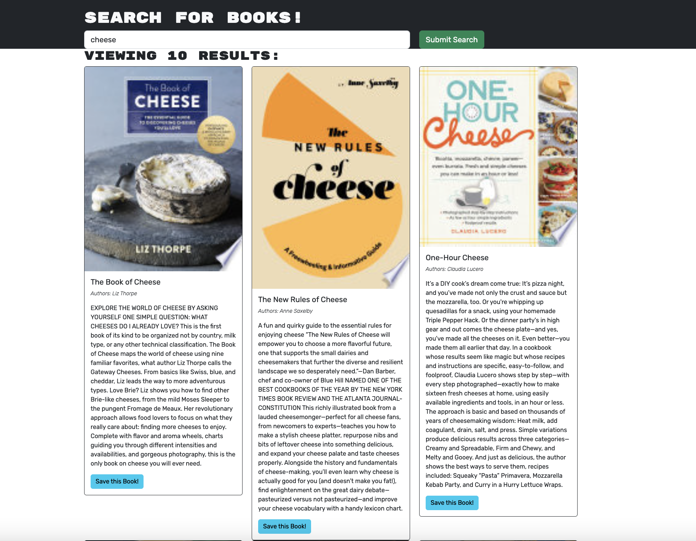

# Google-Books-MERN

## Description

This MERN stack application utilizes the Google Books Api to allow users to search for and discover new books to read. By creating a user account, users can search books by a key word or author and be presented with book titles, pictures, and descriptions. If the user is interested in a book, they can save the book for later viewing. Users without an account, do not have the option to save books. This application aims to address the problem of finding an interesting, and then forgetting to borrow or buy the book later on.

## Installation

No steps are needed to install this application as it is hosted online here: https://ancient-sands-40035.herokuapp.com/

## Usage

Search for books by entering a key word into the search box. When you press "search", a list of books with a description and picture will populate the screen. 

If you would like to save books for future reference, create an account or login by providing an email address and password. There will then be an option to save books from your search results. To view these saved books, select the "saved books" tab. If you would like to remove a book from your saved list, simply press the remove book button.

## Credits

Docs on configuring MongoDB server in Heroku: https://www.mongodb.com/developer/products/atlas/use-atlas-on-heroku/

## License

ISC